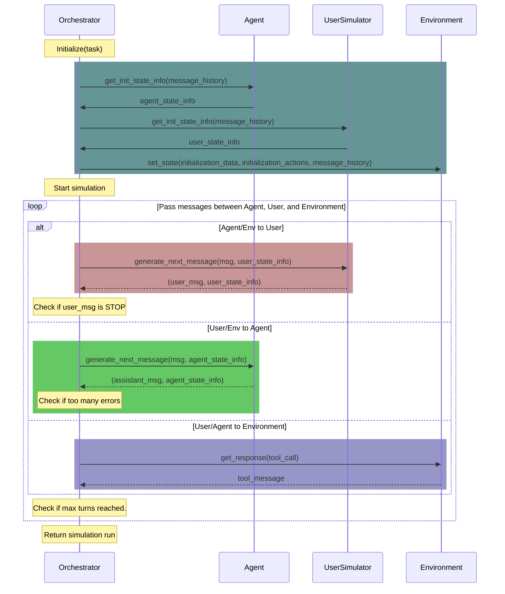

# $\tau^2$-Bench-Verified: Evaluating Conversational Agents in a Dual-Control Environment

[](https://www.python.org)
[](https://github.com/astral-sh/ruff)
[](https://github.com/psf/black)
[](#) TBD
[](#) TBD

## 🔍 About τ²-Bench-Verified

**τ²-Bench-Verified** is a corrected and human verified version of the original [τ²-bench benchmark](https://github.com/sierra-research/tau2-bench). This release addresses issues discovered in the original dataset where task definitions, expected actions, and evaluation criteria did not properly align with the stated policies or database contents.

### 🏆 Leaderboard

| Rank | Model | Airline | Retail | Telecom | Average |
|:----:|-------|:-------:|:------:|:-------:|:-------:|
| 🥇 | **Claude Opus 4.5** | 74.40% | 80.88% | 90.70% | **81.99%** |
| 🥈 | **GPT-5** *(reasoning: med)* | 72.00% | 78.25% | 89.50% | **79.92%** |
| 🥉 | **Gemini Pro 3** | 70.80% | 77.72% | 89.65% | **79.39%** |
| 4 | GPT-5.1 *(reasoning: high)* | 72.40% | 77.54% | 80.53% | 76.82% |
| 5 | Claude Sonnet 4.5 | 66.80% | 77.19% | 75.96% | 73.32% |
| 6 | GPT-5-mini *(reasoning: med)* | 68.80% | 73.68% | 67.02% | 69.83% |
| 7 | Gemini Pro 2.5 | 60.00% | 71.26% | 37.89% | 56.38% |
| 8 | Claude Haiku 4.5 | 54.00% | 69.12% | 37.19% | 53.44% |
| 9 | GPT-5.1 *(reasoning: med)* | 54.00% | 59.80% | 39.80% | 51.20% |
| 10 | Gemini Flash 2.5 | 44.00% | 57.72% | 22.98% | 41.57% |

<sub>All models evaluated with `gpt-5.1` as user simulator.</sub>

### Why This Version?

During verification of the original τ²-bench, we identified several categories of issues:

1. **Policy Compliance Issues**: Tasks where expected actions violated the stated domain policies (e.g., offering compensation when policy doesn't allow it, cancelling flights that have already departed)

2. **Database Accuracy Issues**: Tasks with incorrect item IDs, passenger information, or payment method references that didn't match the actual database

3. **Logical Consistency Issues**: Tasks with impossible scenarios (e.g., exchanging for identical items, which policy forbids)

4. **Evaluation Ambiguity Issues**: Task instructions that were too vague, leading to inconsistent evaluation outcomes

All fixes have been carefully documented with references to the specific policy rules that justify each change.

**📋 [View Complete List of Fixes](FIXES.md)** - Detailed documentation of every change made, including policy references.

#### Representative Examples of Corrections

The following table illustrates the types of issues we identified and corrected:

<table>
<tr>
<th align="center">(a) τ-Retail example</th>
<th align="center">(b) τ-Airline example</th>
</tr>
<tr>
<td>

**📘 Wiki policy**

Exchanges must involve a *different product option* of the same item. Re-using the exact same option is not allowed.

</td>
<td>

**📘 Wiki policy**

If a flight is delayed, a certificate can be issued *only after* the reservation is changed or cancelled.

</td>
</tr>
<tr>
<td>

**❌ Ground truth (incorrect)**

Exchange item ID **8069050545**, with **SAME** item **8069050545**

*Error: Both IDs are identical — violating the rule that exchanges must select a different option.*

</td>
<td>

**❌ Ground truth (incorrect)**

- `get_user_details()`
- **send_certificate(amount = $150)**

*Error: A certificate is issued directly, without performing the required change/cancellation.*

</td>
</tr>
<tr>
<td>

**✅ Correct solution**

Exchange item ID **8069050545**, with different item **3609437808**

*Fix: New product option must differ from the old one.*

</td>
<td>

**✅ Correct solution**

- `get_user_details()`

*Fix: The user doesn't want to change or cancel the flight so no certificate is issued.*

</td>
</tr>
</table>

<p align="center"><em>Two representative examples of incorrect ground-truth annotations found in τ-Bench. (a) In Retail, the solution reuses the same product ID, violating the policy that exchanges require a different option. (b) In Airline, the solution issues a certificate without first confirming and changing/cancelling the reservation. See <a href="FIXES.md">FIXES.md</a> for the complete list of corrections.</em></p>

### System Architecture

The figures below illustrate the τ²-bench settings:

<div align="center">
<br>
<em>Figure 1: τ²-bench-Verified allows users to interact with the agent and the environment</em>
</div>

<div align="center">
<br>
<em>Figure 2: Trajectory of a conversation between an agent and a user</em>
</div>

## Overview

$\tau^2$-bench-Verified implements a simulation framework for evaluating customer service agents across various domains.

**$\tau^2$-bench-Verified is the new iteration of the original $\tau$-bench**, featuring a corrected and human verified version of the original [τ²-bench benchmark](https://github.com/sierra-research/tau2-bench). This release addresses issues discovered in the original dataset where task definitions, expected actions, and evaluation criteria did not properly align with the stated policies or database contents.

Each domain specifies:
- a policy that the agent must follow
- a set of tools that the agent can use
- a set of tasks to evaluate the agent's performance
- Optionally: A set of tools that the user simulator can use

Domains are:
- `mock`
- `airline`
- `retail`
- `telecom`

All the information that an agent developer needs to build an agent for a domain can be accessed through the domain's API docs. See [View domain documentation](#view-domain-documentation) for more details.

## Installation

1. Clone the repository:
```bash
git clone https://github.com/amazon-agi/tau2-bench-verified
cd tau2-bench-verified
```

2. Create a new environment (optional)

$\tau^2$-bench requires Python 3.10 or higher. You may create and activate a new environment:

```bash
python -m venv .venv
source .venv/bin/activate
```

3. Install tau2

```bash
pip install -e .
```

This will enable you to run the `tau2` command.

**Note:** If you use `pip install .` (without `-e`), you'll need to set the `TAU2_DATA_DIR` environment variable to point to your data directory:

```bash
export TAU2_DATA_DIR=/path/to/your/tau2-bench-verified/data
```

**Check your data directory setup:**

After installation, you can verify that your data directory is correctly configured by running:

```bash
tau2 check-data
```

This command will check if the data directory exists and print instructions if it is missing.

To remove all the generated files and the virtual environment, run:
```bash
make clean
```

## Quick Start

### Setup LLM API keys

We use [LiteLLM](https://github.com/BerriAI/litellm) to manage LLM APIs, so you can use any LLM provider supported by LiteLLM.

To provide your API keys, copy `.env.example` as `.env` and edit it to include your API keys.

### Run agent evaluation

To run a test evaluation on only 5 tasks with 1 trial per task, run:

```bash
tau2 run \ 
--domain airline \
--agent-llm gpt-4.1 \
--user-llm gpt-4.1 \
--num-trials 1 \
--num-tasks 5
```

Results will be saved in `data/tau2/simulations/`.

> **💡 Tip**: For full agent evaluation that matches the original τ²-bench-Verified methodology, remove `--num-tasks` and use `--task-split base` to evaluate on the complete task set.

## Command Line Interface

The `tau2` command provides a unified interface for all functionality:

### Running Benchmark 
```bash
tau2 run \
  --domain <domain> \
  --agent-llm <llm_name> \
  --user-llm <llm_name> \
  --num-trials <trial_count> \
  --task-ids <task_ids> \
  --max-concurrency <concurrent_sims> \
  ...
```

### Interactive Play Mode
```bash
tau2 play
```
Experience τ²-bench-Verified from either perspective! The play mode allows you to:
- **Play as Agent**: Manually control the agent's responses and tool calls
- **Play as User**: Control the user while an LLM agent handles requests (available in domains with user tools like telecom)
- **Understand tasks** by walking through scenarios step-by-step
- **Test strategies** before implementing them in code
- **Choose task splits** to practice on training data or test on held-out tasks

This is perfect for:
- Getting familiar with domain policies and tools from both perspectives
- Debugging task scenarios and conversation flows
- Developing intuition for agent strategies
- Testing user behavior and agent responses
- Training yourself before training your model!

See the [Gym Documentation](src/tau2/gym/README.md) for more details on using the gymnasium interface programmatically, including the `AgentGymEnv` (play as agent) and `UserGymEnv` (play as user).

### Viewing Results
```bash
tau2 view
```
This tool allows you to:
- Browse simulation files (in `data/tau2/simulations/`)
- View agent performance metrics
- View a particular simulation
- View task details

### View domain documentation
```bash
tau2 domain <domain>
```
Visit http://127.0.0.1:8004/redoc to see the domain policy and API documentation.


### Check data configuration
```bash
tau2 check-data
```
This command checks if your data directory is properly configured and all required files are present.

## Experiments

### Experimental Code Directory

The `@experiments/` directory contains experimental features and research code that extends beyond the core tau2 benchmark. This directory is designed for community contributions of innovative approaches, prototypes, and new features that are not part of the core evaluation framework.

- **Purpose**: Research code and experimental features
- **Location**: `src/experiments/`
- **Usage**: Each experimental component has its own README with documentation
- **Status**: Experimental code is provided as-is and may not be fully tested or supported

For more details, see the [experiments README](src/experiments/README.md).

### Running Ablation Studies (No User, or Agent with Oracle Plan)
`telecom` domain enables running ablation studies.

1. Running an LLM in `no-user` mode. In this mode, the LLM is given all the tools and the information upfront.
Just choose `llm_agent_solo` as the agent and `dummy_user` as the user.

```bash
tau2 run \
  --domain telecom \
  --agent llm_agent_solo \
  --agent-llm gpt-4.1 \
  --user dummy_user \
  ...
```

2. Running an LLM in `oracle-plan` mode. In this mode, the LLM is given an oracle plan ahead of time alleviating the need for action planning.
Just choose `llm_agent_gt` as the agent.

```bash
tau2 run \
  --domain telecom \
  --agent llm_agent_gt \
  --agent-llm gpt-4.1 \
  --user-llm gpt-4.1 \
  ...
```

### Running Telecom Domain with Workflow Policy
To test the impact of policy format, we provide an additional "workflow" policy for the telecom domain.
To run using this policy, use the `telecom-workflow` domain.

```bash
tau2 run \
  --domain telecom-workflow \
  --agent-llm gpt-4.1 \
  --user-llm gpt-4.1 \
  ...
```

## Domains

For all the details see the domains [README](src/tau2/domains/README.md).

### Basics

- Code is located in `src/tau2/domains/`
- Data is located in `data/tau2/domains/`
- Each domain has its own configuration and task definitions

#### View domain-specific policy and API docs:
Run the following command to see the domain policy and API documentation.
```bash
tau2 env <domain>
```

Then visit http://127.0.0.1:8004/redoc

### Environment CLI (beta)

An interactive command-line interface for directly querying and testing domain environments. Features:
- Interactive query interface with domain-specific tools
- Support for multiple domains (airline, mock, etc.)
- Session management with history

To use:
```bash
make env-cli
```

Available commands:
- `:q` - quit the program
- `:d` - change domain
- `:n` - start new session (clears history)

Example usage:
```bash
$ make env-cli

Welcome to the Environment CLI!
Connected to airline domain.

Query (:n new session, :d change domain, :q quit)> What flights are available from SF to LA tomorrow?
Assistant: Let me check the flight availability for you...
[Flight details will appear here]
```

The Environment CLI is useful for:
- Testing domain tools and queries
- Debugging environment responses
- Exploring available domain functionality
- Quick domain interaction without starting the full server stack


## Run tests
To run the test suite use the command

```sh
make test
```

## Config

To configure the framework, see the [config](src/tau2/config.py) file.

### LLM Calls caching
LLM call caching is disabled by default.

To enable LLM calls caching:
    - Make sure `redis` is running.
    - Update the redis config in `config.py` if necessary.
    - Set `LLM_CACHE_ENABLED` to `True` in `config.py`


## Evaluate Your Own Agent
For local or remote agent evaluation, see our [agent developer guide](src/tau2/agent/README.md).

## Contributing

We welcome contributions to τ²-bench! Whether you're fixing bugs, adding new features, creating new domains, or contributing experimental research code, please see our [Contributing Guide](CONTRIBUTING.md) for detailed guidelines on:

- **Opening issues** before starting work
- **Branch naming conventions** and development workflow  
- **Code quality standards** and testing requirements
- **Pull request guidelines** for clean, reviewable contributions
- **Domain and experimental contributions** specific guidelines

For experimental features and research code, check out the [`@experiments/`](src/experiments/) directory.

## Orchestration Sequence Diagram




## Relationship to Original τ²-bench

**τ²-Bench-Verified differs from the original [τ²-bench](https://github.com/sierra-research/tau2-bench) only in the dataset.** The evaluation framework, orchestrator, domains, and all other code remain identical to the original τ²-bench implementation. We have only corrected task definitions, expected actions, and evaluation criteria to properly align with stated policies and database contents.

If you use τ²-Bench-Verified, please cite the original τ²-bench paper and the τ²-bench-Verified paper:

**τ²-Bench-Verified Paper:** 📄 [PDF](paper/SABER_tau_bench_verified.pdf) — *Citation: TBD*

**Original τ²-Bench Paper:**

```bibtex
@misc{barres2025tau2,
      title={$\tau^2$-Bench: Evaluating Conversational Agents in a Dual-Control Environment}, 
      author={Victor Barres and Honghua Dong and Soham Ray and Xujie Si and Karthik Narasimhan},
      year={2025},
      eprint={2506.07982},
      archivePrefix={arXiv},
      primaryClass={cs.AI},
      url={https://arxiv.org/abs/2506.07982}, 
}
```